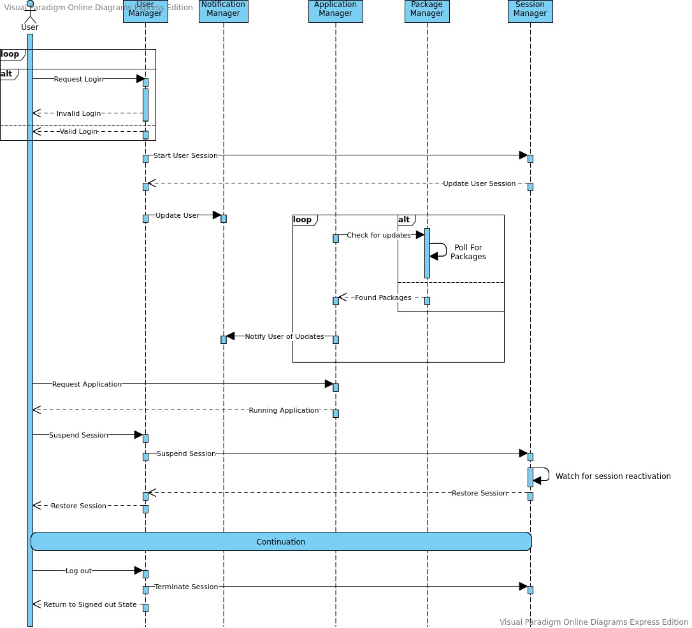

### Nexus OS SDK

This is the SDK layer for the custom Nexus OS operating system.

#### Components

##### Managers

- [User Manager](lib/system/user/manager.dart): Handles all interactions with the user. Including but not limited to authenticating the user, starting user sessions.
- [Notification Manager](lib/system/notifications/manager.dart): Handles anything and everything related to managing notifications.
- [Application Manager](lib/system/applications/manager.dart): Manages the system's applications. It controls all of processes that are started in the user space.
- [Session Manager](): Manages the available user sessions since system boot. It handles events such as sleeping.
- [Package Manager](): Handles how the system packages are mapped,  for example installing rpm/deb packages. It also periodically checks for updates for installed packages.

#### System Diagram

